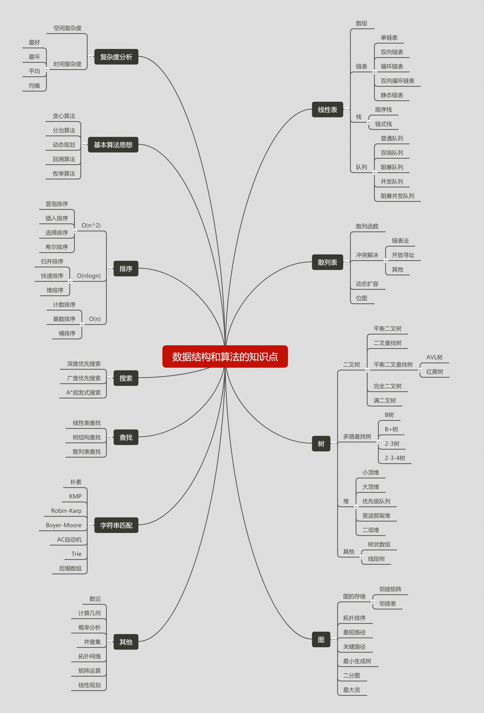

# 起点

第一次接触这些是在大二的课堂上，那时候只是为了应付考试，并没有去学。毕业后，学习这一块的时候太过急躁，想一口吃掉，发现过一段时间就忘了。其实并没有真正掌握。网上相关的资料也繁多，这次打算静下心来，一点一点的去过。

## 数据结构和算法的定义？

**广义上**
 数据结构是指一组数据的存储结构。算法是操作数据的一组方法。

**狭义上**是指某些著名的数据结构和算法，比如队列，栈，堆，二分查找，动态规划等。

**数据结构是为算法服务的，算法要作用在特定的数据结构上**

## 学习过程思考重点

**最重要的概念——复杂度分析（空间复杂度和时间复杂度）。**
复杂度分析占数据结构和算法这门课的半壁江山，是数据结构和算法学习的精髓。数据结构和算法解决的是如何更省，更快地存储和处理数据的问题。因此，我们需要一个考量效率和资源消耗的方法，这就是复杂度分析方法。

掌握好复杂度分析，后面的数据结构和算法才容易学。所以，在学习具体的数据结构和算法前，必须熟练掌握复杂度分析。

## 数据结构和算法的知识点

这张图几乎涵盖数据结构与算法的所有知识点，但作为初学者或非算法工程师，我们并不需要掌握图里面所有知识点。

## 重点学习的知识点：

**10个数据结构：**

*   数组
*   链表
*   栈
*   队列
*   散列表
*   二叉树
*   堆
*   跳表
*   图
*   Tire树

**10个算法：**

*   递归
*   排序
*   二分查找
*   搜索
*   哈希算法
*   贪心算法
*   分治算法
*   回溯算法
*   动态规划
*   字符串匹配算法

**学习需要注意的地方：**

不要死记硬背，不要为了学习而学习。而是要学习它的“**来历**”“**自身特点**”“**适合解决的问题**”以及“**实际的应用场景**”。

学习数据结构和算法的过程，是非常好的思维训练的过程。所以，千万不要被动记忆，要多辨证，多问为什么。

## 事半功倍的学习技巧

### 1.边学边练，适度刷题

一定要花时间，自己用代码将所学到的知识点实现一遍，效果会比单纯看要好。

我们学习的目的是掌握，然后才是应用。刷题就像备战高考大量做题一样，短期内或许有用，但长期来看并不利于我们掌握。所以，要“适度”刷题。

### 2.多问，多思考，多互动

学习最好的方法是，找到几个人一起学习，一块儿讨论切磋，有问题及时寻找老师答疑。

### 3.打怪升级学习法

学习过程中，我们碰到最大问题是，坚持不下来，毕竟基础课程学起来都非常枯燥。

我们可以像玩游戏打怪升级一样，为自己设立一个切实可行的目标。每天都能看到自己一点一点地在成长，获得成就感，这样更容易坚持下来。

### 4.知识需要沉淀，不要想试图一下子掌握所有

在学习的过程中，一定会碰到“拦路虎”。如果哪个知识点没有怎么学懂，不要着急，这是正常的。因为想听一遍、看一遍就把所有知识掌握，这肯定是不可能的。学习知识的过程是反复迭代、不断沉淀的过程。

遇到“拦路虎”，可以先跳过，过几天再重新学一遍。
