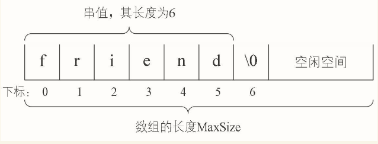
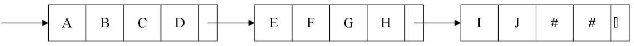

# 串

早先的计算机在被发明时，主要作用是做一些科学和工程的计算工作，也就是现在我们理解的计算器，只不过它比小小计算器功能更强大、速度更快一些。后来发现，在计算机上作非数值处理的工作越来越多，使得我们不得不需要引入对字符的处理。于是就有了字符串的概念。

## 串的定义

串（string）是由零个或多个字符组成的有限序列，又名叫字符串。

一般记为s="a1a2......an"(n≥0)，其中，s是串的名称，用双引号（有些书中也用单引号）括起来的字符序列是串的值，注意引号不属于串的内容。ai（1≤i≤n）可以是字母、数字或其他字符，i就是该字符在串中的位置。串中的字符数目n称为串的长度，定义中谈到“有限”是指长度n是一个有限的数值。零个字符的串称为空串（nullstring），它的长度为零，可以直接用两双引号“""”表示，也可以用希腊字母“Φ”来表示。所谓的**序列，说明串的相邻字符之间具有前驱和后继的关系。**

- 空格串，是只包含空格的串。注意它与空串的区别，空格串是有内容有长度的，而且可以不止一个空格。

- 子串与主串，串中任意个数的连续字符组成的子序列称为该串的子串，相应地，包含子串的串称为主串。

  子串在主串中的位置就是子串的第一个字符在主串中的序号。

  “over”、“end”、“lie”其实可以认为是“lover”、“friend”、“believe”这些单词字符串的子串。

## 串的比较

串的比较是通过组成串的字符之间的编码来进行的，而字符的编码指的是字符在对应字符集中的序号。通过它们串的长度以及它们各个对应位置的字符都相等时，才算是相等

**两个串不相等时，如何判定它们的大小呢。我们这样定义：**

给定两个串：s="a1a2......an"，t="b1b2......bm"，当满足以下条件之一时，s<t。

- 1．n<m，且ai=bi（i=1，2，……，n）。

  例如当s=“hap”，t=“happy”，就有s<t。因为t比s多出了两个字母。

- 2．存在某个k≤min（m，n），使得ai=bi（i=1，2，……，k-1），ak<bk。

  例如当s="happen"，t="happy"，因为两串的前4个字母均相同，而两串第5个字母（k值），字母e的ASCII码是101，而字母y的ASCII码是121，显然e<y，所以s<t。

## 串的抽象数据类型

串的逻辑结构和线性表很相似，不同之处在于串针对的是字符集，也就是串中的元素都是字符，哪怕串中的字符是“123”这样的数字组成，或者“2010-10-10”这样的日期组成，它们都只能理解为长度为3和长度为10的字符串，每个元素都是字符而已。

因此，对于串的基本操作与线性表是有很大差别的。线性表更关注的是单个元素的操作，比如查找一个元素，插入或删除一个元素，但串中更多的是查找子串位置、得到指定位置子串、替换子串等操作。

```
ADT 串(string)
Data
    串中元素仅由一个字符组成，相邻元素具有前驱和后继关系。
Operation
    StrAssign(T, *chars):        生成一个其值等于字符串常量chars的串T。
    StrCopy(T, S):               串S存在，由串S复制得串T。
    ClearString(S):              串S存在，将串清空。
    StringEmpty(S):              若串S为空，返回true，否则返回false。
    StrLength(S):                返回串S的元素个数，即串的长度。
    StrCompare(S, T):            若S>T，返回值>0，若S=T，返回0，若S<T，返回值<0。
    Concat(T, S1, S2):           用T返回由S1和S2联接而成的新串。
    SubString(Sub, S, pos, len): 串S存在，1≤pos≤StrLength(S)，
                                 且0≤len≤StrLength(S)-pos+1，用Sub返
                                 回串S的第pos个字符起长度为len的子串。
    Index(S, T, pos):            串S和T存在，T是非空串，1≤pos≤StrLength(S)。
                                 若主串S中存在和串T值相同的子串，则返回它在主串S中
                                 第pos个字符之后第一次出现的位置，否则返回0。
    Replace(S, T, V):            串S、T和V存在，T是非空串。用V替换主串S中出现的所有
```

## 串的存储结构

### 串的顺序存储结构

串的顺序存储结构是用一组地址连续的存储单元来存储串中的字符序列的。按照预定义的大小，为每个定义的串变量分配一个固定长度的存储区。一般是用定长数组来定义。

既然是定长数组，就存在一个预定义的最大串长度，一般可以将实际的串长度值保存在数组的0下标位置，有的书中也会定义存储在数组的最后一个下标位置。但也有些编程语言不想这么干，觉得存个数字占个空间麻烦。它规定在串值后面加一个不计入串长度的结束标记字符，比如“\0”来表示串值的终结，这个时候，你要想知道此时的串长度，就需要遍历计算一下才知道了，其实这还是需要占用一个空间，何必呢。



于是对于串的顺序存储，有一些变化，串值的存储空间可在程序执行过程中动态分配而得。比如在计算机中存在一个自由存储区，叫做“堆”。这个堆可由C语言的动态分配函数malloc()和free()来管理。

### 串的链式存储结构

于串的链式存储结构，与线性表是相似的，但由于串结构的特殊性，结构中的每个元素数据是一个字符，如果也简单的应用链表存储串值，一个结点对应一个字符，就会存在很大的空间浪费。因此，一个结点可以存放一个字符，也可以考虑存放多个字符，最后一个结点若是未被占满时，可以用“#”或其他非串值字符补全



这里一个结点存多少个字符才合适就变得很重要，这会直接影响着串处理的效率，需要根据实际情况做出选择。

但串的链式存储结构除了在连接串与串操作时有一定方便之外，总的来说不如顺序存储灵活，性能也不如顺序存储结构好

## 朴素的模式匹配算法

就是对主串的每一个字符作为子串开头，与要匹配的字符串进行匹配。对主串做大循环，每个字符开头做T的长度的小循环，直到匹配成功或全部遍历完成为止。

## KMP模式匹配算法

//TODO:....