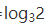

数据结构和算法主要解决两个问题：

*   快-如何让代码运行得更快
  
*   省-如何让代码更省内存空间

复杂度分析就是考量一个算法的执行效率，分析、统计算法的执行效率和资源消耗。

  

# 为什么需要复杂度分析？

你可能会疑惑，我把代码执行一遍，通过监控和统计，可以得到算法的执行时间和占用的内存。这种方法不是比复杂度分析更准确吗？

这种评估算法执行效率的方法有个名字，叫*事后统计法*。但这种统计方法有一定的局限性。

### 事后统计法的局限有

- 1.测试结果非常依赖测试环境

    用性能不同的计算机（处理器）执行同样的一段代码，得到结果也是不同的。

- 2.测试结果受数据规模的影响很大

    举个列子，对同一个排序算法，待排序数据的有序度不一样，排序的执行时间会有很大的差别。极端情况下，如果数据已经是有序的，那排序算法不需要做任何操作，执行时间非常短。如果数据非常混乱，执行时间就会长很多。这样的测试结果，很难如实反映算法的性能。

  

## 如何做复杂度分析

### 大O复杂度表示法

- 算法的执行效率，粗略讲是指算法代码执行的时间。

- 规律：所有代码的执行时间T(n)与每行代码的执行次数成正比。

- 公式：

   -  T(n)：表示代码执行的时间
   - n ：表示数据规模的大小
   -  f(n)：表示每行代码执行次数总和
   - O：表示代码执行时间T(n)与f(n)表达式成正比

大O时间复杂度不是表示代码真正的执行时间，而是表示代码执行时间随数据规模增长的**变化趋势**。所以，也叫 **渐进时间复杂度**，简称 **时间复杂度**。

  
### 例子分析

我们假设**每行代码执行的时间**都一样，为`unit_time` 。

- 例子1：
    ```javascript
    function cal(n){
        var sum = 0;
        for(var i=1;i<=n;i++){
            sum += i;
        }
        return sum;
    }
    ````  
    第2，6行代码的执行时间分别为1个`unit_time`，第3，4行代码的执行时间分别为n个`unit_time`。所以这段代码的总执行时间为`（2n+2)*unit_time`，用大O表示为`T(n) = O(2n+2)`。

- 例子2：
    ```javascript
    function cal(n){
        var sum = 0;
        for(var i=1;i<=n;i++){
            for(var j=1;j<=n;j++){
                sum += 1;
            }
        }
        return sum;
    }
    ````
    
    第2，8行代码的执行时间分别为1个`unit_time`，第3行代码的执行时间为n个`unit_time`，第4，5行代码的执行时间分别是`n*n个unit_time`。所以这段代码的总执行时间为`(2*n*n + n + 2)*unit_time`，用大O表示为`T(n) = O(2*n*n + n + 2)`。
    
    上面介绍到大O时间复杂度表达式表示的是执行时间随数据规模增长的变化趋势，我们假设数据很大很大，而公式中的低阶、常量、系数这三部分不能左右增长趋势，所以都可以忽略，只保留一个最大量级。
  
- 以上两个例子的表达式可记为：

    例子1：`T(n) = O(2n+2) >> T(n) = O(n)`

    例子2：`T(n) = O(2*n*n + n + 2 >> T(n) = O(n*n`)

## 时间复杂度分析的实用方法

### 1.只关注循环执行次数最多的一段代码

大 O 这种复杂度表示方法只是表示一种变化趋势。我们通常会忽略公式中的常量、低阶和系数，只记录一个最大阶数的量级。

### 2.加法法则：总复杂度等于量级最大的那段代码的复杂度

假如一段代码有三个循环，分别执行100次，n次，`n*n`次。表达式为`T(n) = 100 + O(n) + O(n\*n)`，根据这一法则，忽略100和`O(n)`，最后表达式简化为` T(n) = O(n*n)`。

  

### 3.乘法法则：嵌套代码的复杂度等于嵌套内外代码复杂度的乘积

拿例子2的代码举例，这段代码有两个循环，每个循环本身均执行了n次，均表示为T1= O(n).

那总的时间复杂度为T(n) = O(n) * O(n) = O(n*n)

## 常见的大O 表达式

 

上面的复杂度量级，粗略分为两类，多项式量级 和 非多项式量级。其中，非多项式量级只有两个：`O(2^n)` 和 `O(n!)`

**NP（Non-Deterministic Polynomial，非确定多项式）问题：**

是指时间复杂度为非多项式量级的算法问题。当数据规模n越来越大时，非多项式量级算法的执行会急剧增加，求解问题的执行时间无限增长。所以，非多项式时间复杂度的算法是非常低效的。

## 常见的多项式时间复杂度

### 1. O(1)

表示代码的执行时间不随n的增长而增长。一般情况下，只要算法中不存在 **循环语句**、 **递归语句** 、 即使有成千上万行代码，其时间复杂度也是O(1)。

### 2.O(logn)、O(nlogn)

```javascript
var i=1;
while(i<=n){
    i = i * 2;
}

```
这段代码主要计算第三行代码被执行的次数，由此得到这段代码的时间复杂度。这段代码每次循环得到的i其实是等比数列，如图：

 

所以，只有知道x值，就知道这行代码的执行次数。通过  求解x值，于是都得到  ，所以时间复杂度为  。

但为什么对数阶时间复杂度都极为O(logn)？ 对数之间是可以相互转换的，  等于  ，所以  =    ，其中C =  是一个常量，可以忽略，即  等于  。所以，在对数阶时间复杂度的表示方法里，忽略对数的“底”，统一表示为O(logn)

如果一段代码的时间复杂度为O(logn)，循环执行n遍，时间复杂度就为O(nlogn)。其常见算法有归并排序、快速排序等。
  
### 3. O(m+n)
```javascript
function cal(m,n){
    var sum_1 = 0;
    for( var i = 1;i<m;i++){
        sum_1 = sum_1 + i;
    }

    var sum_2 = 0;
    for( var j = 1;j<n;j++){
        sum_2 = sum_2 + j;
    }

    return sum_1 + sum_2;
}
```

因为无法估量m和n谁的量级大，所以在表达复杂度时，不能简单利用加法法则，忽略其中的一个。所以上面的时间复杂度为O(m+n)。

## 空间复杂度分析

时间复杂度的全称是渐进时间复杂度，表示算法的执行时间与数据规模之间的增长关系。

空间复杂度的全称是渐进空间复杂度，表示算法的存储空间与数据规模之间的增长关系。

空间复杂度的计算公式记作：S(n) = O(f(n))。其中，n为问题的规模，f(n)为语句关于n所占存储空间的函数。

常见的空间复杂度是O(1)、O(n)、O(n^2)

## 小结

常见复杂度从低阶到高阶有：

O(1) < O(logn) < O(n) < O(nlogn) < O(n^2)

  

## 思考

Q：有人说，我们项目之前都会进行性能测试，再做代码的时间复杂度、空间复杂度分析，是不是多此一举？而且，每段代码都分析一下时间复杂度，空间复杂度，是不是很浪费时间呢？你怎么看待这个问题呢？

A：像前面说的，虽然项目会做性能测试，但很难覆盖所有环境(硬件)，测试数据规模范围也比较窄。做复杂度分析可以补性能测试的不足，帮助我们编写高质量代码。同时，随着我们练习和分析次数的增多，分析复杂度的时间会越来越快。