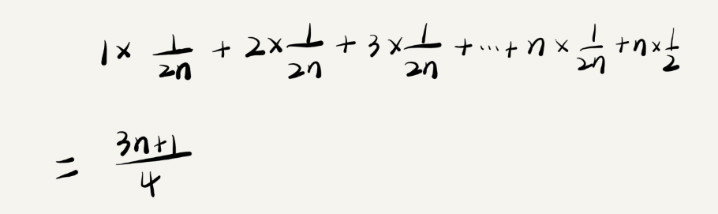

# 浅析最好、最坏、平均、均摊时间复杂度

四个知识点：

*   最好情况时间复杂度（best case time complexity)

*   最坏情况时间复杂度（worst case time complexity)

*   平均情况时间复杂度（average case time complexity)
    
*   均摊时间复杂度（amortized time complexity)

## 最好、最坏情况时间复杂度

```javascript
function find(array,x){
     var pos = -1;
     for(var i=0;i<array.length;i++){
         if(array[i] == x){
             pos = i;
             break;
         }
     }
     return pos;
}
```

上面代码表示，查找变量x在数组array的位置。如果x不在数组array里，则返回-1。通过从数组第一个元素开始找，当找到变量x时则不继续往下找。否则，会遍历完整个数组。

- 最好情况是，数组第一个元素就是要找的变量x，此时的时间复杂度为O(1)，即最好情况时间复杂度。

- 最坏情况是，要遍历完整个数组，此时的时间复杂度为O(n)，即最坏情况时间复杂度。

## 平均情况时间复杂度

最好情况时间复杂度和最坏情况时间复杂度属于极端情况下的复杂度，发生的概率并不好。于是，引入另一个概念：平均情况时间复杂度。

平均情况时间复杂度需要把各种情况出现的概率考虑进去，需要用到一点概率论的知识。

- 1.要查找的数据下，要么在数组里，要么不在数组里。这两种情况对应的概率统计很麻烦，可以简化点。假设在数组中与不在数组中的概率都为1/2。

- 2.要查找的数据出现在数组的0~n-1的n个位置的概率是一样的，为1/n。

- 3.所以，要查找的数据出现在数组0~n-1中任意位置的概率是1/2n。

当我们把每种情况发生的概率也考虑进去，平均时间复杂度的计算公式为：

 

这个值是概率论中的加权平均值，也叫期望值。所以，平均时间复杂度的全称应该叫**加权平均时间复杂度**或**期望时间复杂度**。

上面的代码的加权平均值为(3n+1)/4，用大O表示法表示，去掉系数和常量，加权平均时间复杂度是O(n)。

在大多数情况下，我们并不需要区分最好、最坏、平均情况时间复杂度。**一般情况下，我们使用一个复杂度就可以了。只有同块代码在不同的情况下，时间复杂度有量级的差距，才会使用这三种复杂度表示法来区分。**

## 均摊时间复杂度

在代码执行的所有复杂度情况中绝大多数是低级别的复杂度，个别情况是高级别复杂度且发生具有一定的时序关系。针对这种特殊场景的复杂度分析，不需要像平均复杂度分析方法一样找出所有的情况及相应的发生概率，然后再计算加权平均值。

针对这种特殊的场景，采用更简单的分析方法：摊还分析法。这分析方法是将高级别复杂度均摊到低级别复杂度中，得到的时间复杂度叫，**均摊时间复杂度**。

常用的应用场景：

对一个数据结构进行一组连续操作中，大部分情况下时间复杂度都很低，只有个别情况下时间复杂度比较高，而且这些操作之间存在前后连贯的时序关系。这时，可以将这一组操作放在一起分析，看能否将较高时间复杂度的操作的耗时，平摊到时间复杂度较低的操作上。而且，在能够应用均摊时间复杂度分析的场合，一般均摊时间复杂度就等于最好时间复杂度。

均摊时间复杂度可以认为是一种特殊的平均时间复杂度，但在实际运用中，不用特意区别它们。分析得到的结果叫平均或均摊，只是个说法，并不重要。

## 思考

Q：来分析下面add()函数的时间复杂度
```javascript
//全局变量，大小为10的数据array，长度len，下标i
var array = new Array(10);
var len = 10;
var i = 0;

//往数组中添加一个元素
function add(elem){
    if(i>=len){ //数据空间不够
        //重新申请一个2倍
    }
}
```