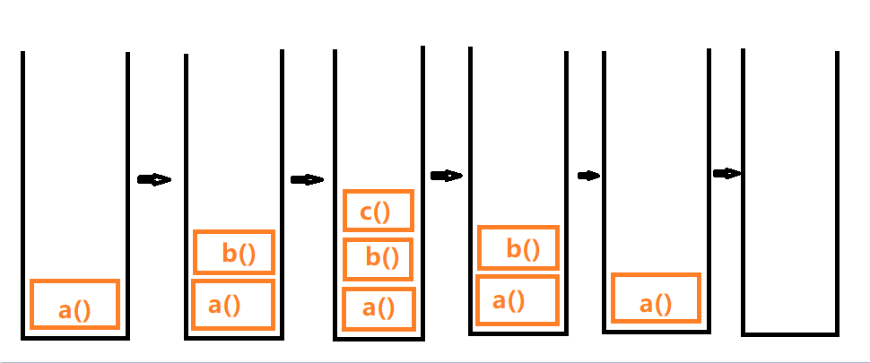
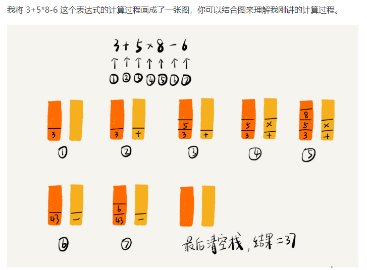
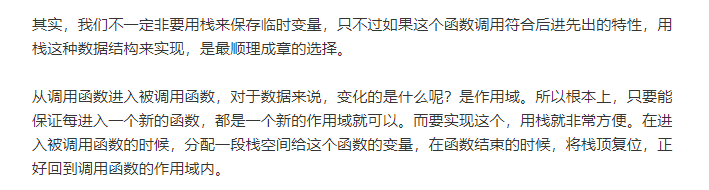

# 栈

>栈（stack）又名堆栈，它是一种运算受限的线性表。

- 顺序栈
  - 两栈共享空间
- 链栈

其限制是仅允许在表的一端进行插入和删除运算。这一端被称为**栈顶**（表尾），相对地，把另一端称为**栈底**。

向一个栈插入新元素又称作进栈、入栈或压栈，它是把新元素放到栈顶元素的上面，使之成为新的栈顶元素；

从一个栈删除元素又称作出栈或退栈，它是把栈顶元素删除掉，使其相邻的元素成为新的栈顶元素。

栈的特点是先进先出，只允许在一端插入和删除数据。

栈对线性表的插入和删除的位置进行了限制，并没有对元素进出的时间进行限制，也就是说，在不是所有元素都进栈的情况下，事先进去的元素也可以出栈，只要保证是栈顶元素出栈就可以。

**举例来说，如果我们现在是有3个整型数字元素1、2、3依次进栈，会有哪些出栈次序呢？**

第一种：1、2、3进，再3、2、1出。这是最简单的最好理解的一种，出栈次序为321。

第二种：1进，1出，2进，2出，3进，3出。也就是进一个就出一个，出栈次序为123。

第三种：1进，2进，2出，1出，3进，3出。出栈次序为213。

第四种：1进，1出，2进，3进，3出，2出。出栈次序为132。

第五种：1进，2进，2出，3进，3出，1出。出栈次序为231。

有没有可能是312这样的次序出栈呢？答案是肯定不会。因为3先出栈，就意味着，3曾经进栈，既然3都进栈了，那也就意味着，1和2已经进栈了，此时，2一定是在1的上面，就是更接近栈顶，那么出栈只可能是321，不然不满足123依次进栈的要求，所以此时不会发生1比2先出栈的情况。

## 栈的抽象数据类型

对于栈来讲，理论上线性表的操作特性它都具备，可由于它的特殊性，所以针对它在操作上会有些变化。特别是插入和删除操作，我们改名为push和pop，英文直译的话是压和弹，更容易理解。你就把它当成是弹夹的子弹压入和弹出就好记忆了，我们一般叫进栈和出栈。

```
ADT 栈(stack)
Data
    同线性表。元素具有相同的类型，相邻元素具有前驱和后继关系。
Operation
    InitStack(*S):    初始化操作，建立一个空栈S。
    DestroyStack(*S): 若栈存在，则销毁它。
    ClearStack(*S):   将栈清空。
    StackEmpty(S):    若栈为空，返回true，否则返回false。
    GetTop(S, *e):    若栈存在且非空，用e返回S的栈顶元素。
    Push(*S, e):      若栈S存在，插入新元素e到栈S中并成为栈顶元素。
    Pop(*S, *e):      删除栈S中栈顶元素，并用e返回其值。
    StackLength(S):   返回栈S的元素个数。
endADT
```

## 常含几个方法

- push(element(s))：添加一个（或几个）新元素到栈顶。
- pop() ：移除栈顶的元素，同时返回被移除的元素。
- peek() ：返回栈顶的元素，不对栈做任何修改（这个方法不会移除栈顶的元素，仅仅返回它）。
- isEmpty() ：如果栈里没有任何元素就返回 true ，否则返回 false 。
- clear() ：移除栈里的所有元素。
- size() ：返回栈里的元素个数。这个方法和数组的 length 属性很类似。
  
## 如何实现一个栈

栈可以用数组实现，也可以用链表来实现。栈是线性表的特例，那么栈的顺序存储其实也是线性表顺序存储的简化，我们简称为顺序栈。线性表是用数组来实现的，想想看，对于栈这种只能一头插入删除的线性表来说，用数组哪一端来作为栈顶和栈底比较好？

对，没错，下标为0的一端作为栈底比较好，因为首元素都存在栈底，变化最小，所以让它作栈底。

```javascript
function Stack(){
    var items = [];
    
    //入栈
    this.push = function(elem){
        items.push(elem);
    }
    
    //出栈
    this.pop = function(){
        return items.pop();
    }
    
    //返回栈顶元素
    this.peek = function(){
        return items[items.length -1];
    }

    //是否是空栈
    this.isEmpty = function(){
        return items.length;
    }

    //栈的长度
    this.size = function(){
        return items.length;
    }

    //清空栈
    this.clear = function(){
        items = [];
    }

    //打印栈
    this.print = function(){
        console.log(items.toString());
    }
}
```

### 两栈共享空间

通常都是当两个栈的空间需求有相反关系时，也就是一个栈增长时另一个栈在缩短的情况。就像买卖股票一样，你买入时，一定是有一个你不知道的人在做卖出操作。有人赚钱，就一定是有人赔钱。这样使用两栈共享空间存储方法才有比较大的意义。否则两个栈都在不停地增长，那很快就会因栈满而溢出了。
当然，这只是针对两个具有相同数据类型的栈的一个设计上的技巧，如果是不相同数据类型的栈，这种办法不但不能更好地处理问题，反而会使问题变得更复杂，大家要注意这个前提。

## 顺序栈与链栈

它们在时间复杂度上是一样的，均为O(1)。对于空间性能，顺序栈需要事先确定一个固定的长度，可能会存在内存空间浪费的问题，但它的优势是存取时定位很方便，而链栈则要求每个元素都有指针域，这同时也增加了一些内存开销，但对于栈的长度无限制。所以它们的区别和线性表中讨论的一样，**如果栈的使用过程中元素变化不可预料，有时很小，有时非常大，那么最好是用链栈**，反之，如果它的变化在可控范围内，建议使用顺序栈会更好一些。

## 栈的作用

有的同学可能会觉得，用数组或链表直接实现功能不就行了吗？干吗要引入栈这样的数据结构呢？这个问题问得好。
其实这和我们明明有两只脚可以走路，干吗还要乘汽车、火车、飞机一样。理论上，陆地上的任何地方，你都是可以靠双脚走到的，可那需要多少时间和精力呢？我们更关注的是到达而不是如何去的过程。
栈的引入简化了程序设计的问题，划分了不同关注层次，使得思考范围缩小，更加聚焦于我们要解决的问题核心。反之，像数组等，因为要分散精力去考虑数组的下标增减等细节问题，反而掩盖了问题的本质。
所以现在的许多高级语言，比如Java、C#等都有对栈结构的封装，你可以不用关注它的实现细节，就可以直接使用Stack的push和pop方法，非常方便。

## 递归和栈的关系

从计算机系统的内部说起。前面我们已经看到递归是如何执行它的前行和退回阶段的。递归过程退回的顺序是它前行顺序的逆序。在退回过程中，可能要执行某些动作，包括恢复在前行过程中存储起来的某些数据。

这种存储某些数据，并在后面又以存储的逆序恢复这些数据，以提供之后使用的需求，显然很符合栈这样的数据结构，因此，编译器使用栈实现递归就没什么好惊讶的了。

简单的说，就是在前行阶段，对于每一层递归，函数的局部变量、参数值以及返回地址都被压入栈中。在退回阶段，位于栈顶的局部变量、参数值和返回地址被弹出，用于返回调用层次中执行代码的其余部分，也就是恢复了调用的状态。
当然，对于现在的高级语言，这样的递归问题是不需要用户来管理这个栈的，一切都由系统代劳了。

## 栈的应用

### 栈在函数调用中的应用

函数被调用时，会被加入到调用栈顶部，执行结束后，就会从调用栈顶移除该函数。
```javascript
function a (){
    b();
}

function b(){
    c();
};

a();
```
 
 
上图表示函数调用执行过程栈的变化。

### 栈在表达式求值中的应用（后缀（逆波兰）表示法定义）

#### 中缀表达式转后缀表达式

我们把平时所用的**标准四则运算表达式**，即“9+(3-1)×3+10÷2”叫做中缀表达式。因为所有的运算符号都在两数字的中间，现在我们的问题就是中缀到后缀的转化。

中缀表达式“9+(3-1)×3+10÷2”转化为后缀表达式“9 3 1-3*+10 2/+”。

规则：**从左到右遍历中缀表达式的每个数字和符号，若是数字就输出，即成为后缀表达式的一部分；若是符号，则判断其与栈顶符号的优先级，是右括号或优先级不高于栈顶符号（乘除优先加减）则栈顶元素依次出栈并输出，并将当前符号进栈，一直到最终输出后缀表达式为止。**

表达式求值是通过两个栈来实现，一个栈保存操作数，另一个栈保存运算符。

从左向右遍历表达式，当遇到数字时，将数字压入操作数栈；当遇到操作符时，与运算符栈的栈顶元素比较。

如果比运算符栈顶元素的优先级高，就将当前运算符压入栈；

如果比运算符栈顶元素的优先级低或者相同，从运算符中取栈顶运算符，从操作数栈的栈顶取2个操作数，然后进行计算，再把计算结果压入操作数栈，继续比较。

例子：

 

### 栈在括号匹配中的应用

用来检测括号的嵌套是否合法

## 解答开篇

实现浏览器的前进和后退功能，使用两个栈（X和Y）实现。

*   首次浏览的页面依次压入栈X

*   当点击后退时，再依次从栈X中出栈，并将出栈的数据依次压入栈Y

*   当点击前进时，依次从栈Y中出栈，并将出栈的数据依次压入X
    
*   当栈X中没有数据时，说明没有页面可以继续后退浏览
    
*   当栈Y中没有数据时，说明没有页面可以继续前进浏览
    
## 思考

1.为什么函数调用要用“栈”来保存临时变量？用其他数据结构不行吗？

参考答案：

 