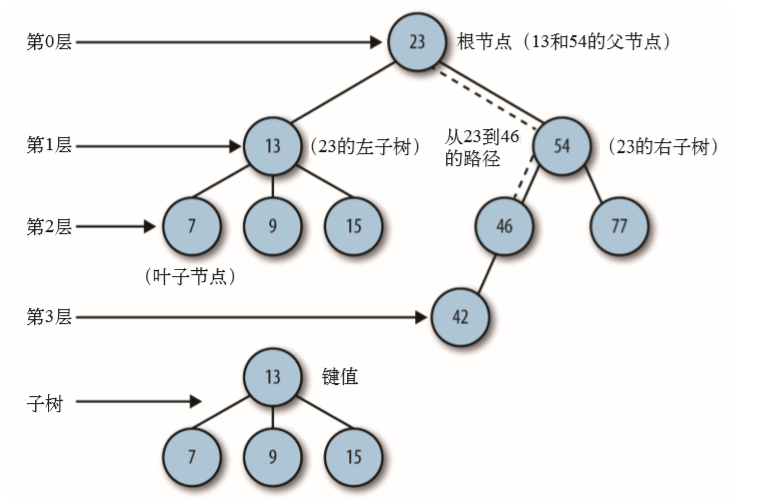
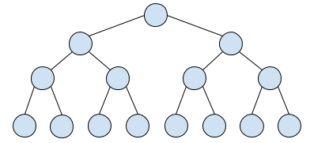

# 二叉树

## 定义

树是一种非线性表数据结构，由一组以边连接的**节点**组成。在现实中像树的例子有家谱、组织结构图等。

### 树的术语

 

#### 节点

树中的每个元素称为节点，两个节点之间用线（边）连接表示它们是父子关系。

每个节点都有一个父节点（除根节点外），以及零个或多个子节点。

##### 路径

从一个节点到另一个节点的这一组边称为路径（边）

##### 根节点

位于树的顶部的节点称为根节点，它没有父节点。

#### 叶子节点

没有子节点的节点称为叶子节点或者叶节点

#### 兄弟节点

当多个节点的父节点是同一个节点时，它们互称为兄弟节点

#### 高度

节点的高度 = 节点到叶子节点的 **最长路径**（边数）。

高度是从树的最底层的叶子节点开始，从下往上计数，并且计数的起点是0。

#### 深度

节点的深度 = 根节点到这个节点所经历的 **边的个数**。

深度是从树的根节点开始，从上往下计数，并且计数的起点是0.所以，根节点的深度是0

#### 层

节点的层数 = 节点的深度 + 1。

层数的跟深度的计算类似，但它的计数起点是 1，即根节点位于第 1 层

#### 树的高度

树的高度 = 根节点的高度

二叉树

二叉树是最常用的树结构。

每个节点**最多**有两个子节点，分别为左子节点和右子节点。二叉树可以同时有两个左右子节点，也可以只有一个左子节点或右子节点。

网络异常，图片无法展示

### 特殊的二叉树

#### 满二叉树（Fully Binary Tree）

 

叶子节点全部在最底层，且除叶子节点外，每个节点都有左右两个子节点

#### 完全二叉树（Complete Binary Tree）

 

叶子节点都在最底下两层，最后一层的叶子节点都靠左排列，并且除了最后一层，其他层的节点个数都要达到最大。

为什么完全二叉树的最后一层的叶子节点要靠左排列？

存储二叉树有两种方法：

*   基于指针或者引用的链式存储法
    
*   基于数组的顺序存储法
    
链式存储法：

每个节点有三个字段，一个存储数据，另外两个左右两个子节点的指针。只要找到根节点，就可以通过左右子节点的指针将整颗树串起来。

数组的顺序存储法：

把根节点存在下标为 i = 1 的位置，左子节点存储在下标为 2*i = 2的位置，右子节点存储在下标为 2 *i + 1 = 3的位置。以此类推，B节点左子节点存储在 2 * i = 2 * 2 = 4的位置，右子节点存储在 2 * i + 1 = 2 * 2 + 1 = 5 的位置。

  

那数组可以看出根节点开始，从左往右，都是先存储左子节点，再右子节点。这符合完全二叉树的结构，也是为什么完全二叉树要求最后一层的子节点都要靠左。

**完全二叉树的最常用的存储方式是数组，而链式方法需要额外存储指针，占用一定的存储空间。（回应标题的问题）**

堆其实是一种完全二叉树。

#### 二叉搜索树（Binary Search Tree）

网络异常，图片无法展示

二叉搜索树（BST）也称为二叉查找树、有序二叉树（ordered binary tree）或排序二叉树（**排序二叉树**）

二叉搜索树只允许左子节点存储比父节点小的值，在右子节点存储比父节点大或等于的值。

相比其他数据结构，二叉搜索树的优势在于查找、插入的时间复杂度低，为O(log n)。

### [](#99dswa)[](#99dswa)二叉树的遍历

#### [](#n08ctk)[](#n08ctk)前序遍历/先序遍历

对于树中的任意节点来说，先打印这个节点，然后再打印它的左子树，最后打印它的右子树。
```javascript
function preOrder(node){
    if(!node) return;
    console.log(node.data);
    preOrder(node.left);
    preOrder(node.right);
}
```
#### 中序遍历

对于树中的任意节点来说，先打印它的左子树，然后再打印它本身，最后打印它的右子树
```javascript
function inOrder(node){
    if(!node) return;
    preOrder(node.left);
    console.log(node.data);
    preOrder(node.right);
}
```
#### 后序遍历

对于树中的任意节点来说，先打印它的左子树，然后打印它的右子树，最后打印它本身
```javascript
function postOrder(node){
    if(!node) return;
    postOrder(node.left);
    postOrder(node.right);
    console.log(node.data);
}
```
## 思考

1.给定一组数据，比如1，3, 5,6,9,10. 你来算算，可以构建多少种不同的二叉树？

2.二叉树的遍历方式，除了前、中、后序三种外，还有一种是按层遍历，这个如何实现？