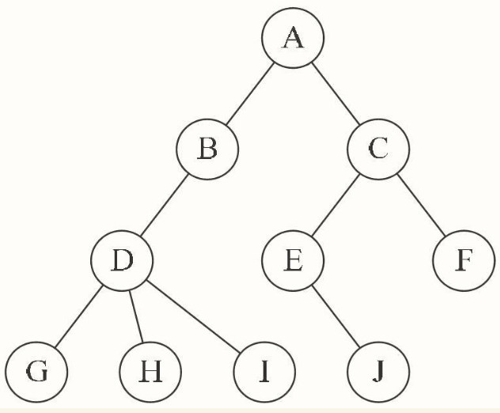
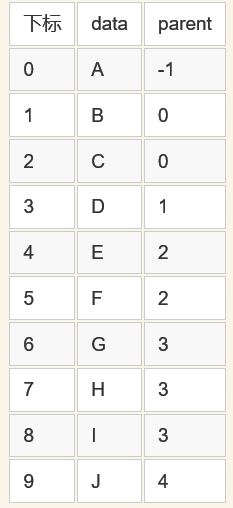
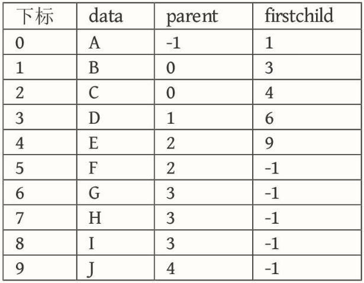
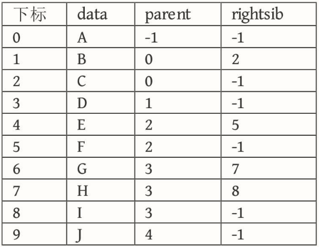
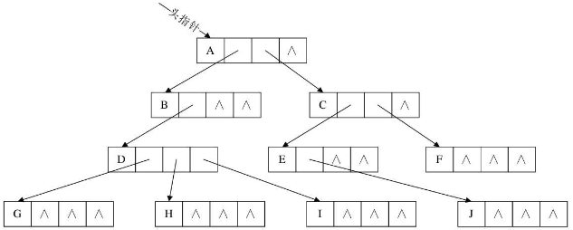
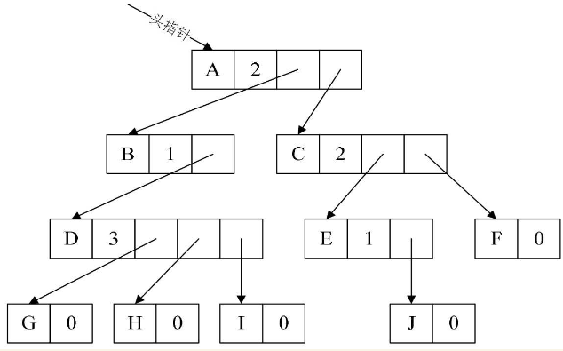
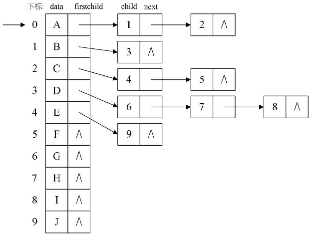
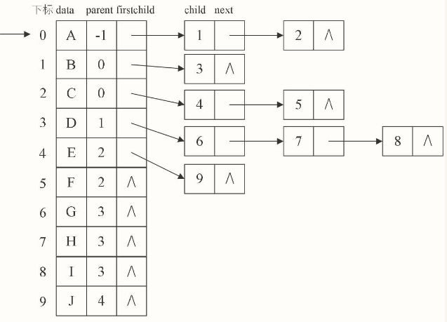
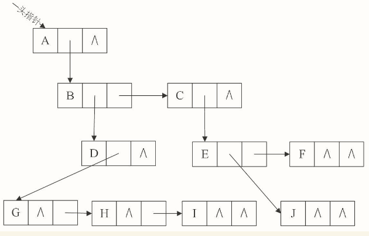
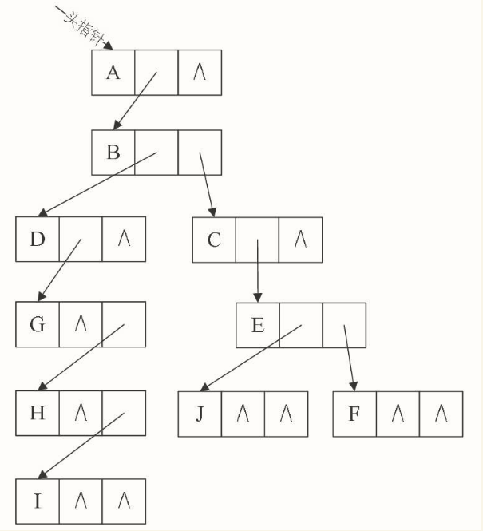

# 二叉树

## 定义

树（Tree）是n（n≥0）个结点的有限集。n=0时称为空树。

在任意一棵非空树中：（1）有且仅有一个特定的称为根（Root）的结点；（2）当n＞1时，其余结点可分为m（m＞0）个互不相交的有限集T1、T2、……、Tm，其中每一个集合本身又是一棵树，并且称为根的子树（SubTree）。

树的定义其实就是我们在讲解栈时提到的递归的方法。也就是在树的定义之中还用到了树的概念，这是一种比较新的定义方法。

树的定义还需要强调两点：

**1.n>0时根结点是唯一的，不可能存在多个根结点，别和现实中的大树混在一起，现实中的树有很多根须，那是真实的树，数据结构中的树是只能有一个根结点。**

**2.m>0时，子树的个数没有限制，但它们一定是互不相交的。**

树是一种非线性表数据结构，由一组以边连接的**节点**组成。在现实中像树的例子有家谱、组织结构图等。

## 树的抽象数据类型

相对于线性结构，树的操作就完全不同了，这里我们给出一些基本和常用操作。

```
ADT 树(tree)
Data
    树是由一个根结点和若干棵子树构成。树中结点具有相同数据类型及层次关系。
Operation
    InitTree(*T):               构造空树T。
    DestroyTree(*T):            销毁树T。
    CreateTree(*T, definition): 按definition中给出树的定义来构造树。
    ClearTree(*T):              若树T存在，则将树T清为空树。
    TreeEmpty(T):               若T为空树，返回true，否则返回false。
    TreeDepth(T):               返回T的深度。
    Root(T):                    返回T的根结点。
    Value(T, cur_e):            cur_e是树T中一个结点，返回此结点的值。
    Assign(T, cur_e, value):    给树T的结点cur_e赋值为value。
    Parent(T, cur_e):           若cur_e是树T的非根结点，则返回它的双亲，否则返回空。
    LeftChild(T, cur_e):        若cur_e是树T的非叶结点，则返回它的最左孩子，否则返回空。
    RightSibling(T, cur_e):     若cur_e有右兄弟，则返回它的右兄弟，否则返回空。
    InsertChild(*T, *p, i, c):  其中p指向树T的某个结点，i为所指结点p的度加上1，
                                非空树c与T不相交，操作结果为插入c为树T中p指结点的第i棵子树。
    DeleteChild(*T, *p, i):     其中p指向树T的某个结点，i为所指结点p的度，
                                操作结果为删除T中p所指结点的第i棵子树。
endADT
```

### 树的术语

 

#### 节点

树中的每个元素称为节点，两个节点之间用线（边）连接表示它们是父子关系。

每个节点都有一个父节点（除根节点外），以及零个或多个子节点。

##### 路径

从一个节点到另一个节点的这一组边称为路径（边）

##### 根节点

位于树的顶部的节点称为根节点，它没有父节点。

#### 叶子节点

没有子节点的节点称为叶子节点或者叶节点

#### 兄弟节点

当多个节点的父节点是同一个节点时，它们互称为兄弟节点

#### 高度

节点的高度 = 节点到叶子节点的 **最长路径**（边数）。

高度是从树的最底层的叶子节点开始，从下往上计数，并且计数的起点是0。

#### 深度

节点的深度 = 根节点到这个节点所经历的 **边的个数**。

深度是从树的根节点开始，从上往下计数，并且计数的起点是0.所以，根节点的深度是0

#### 层

节点的层数 = 节点的深度 + 1。

层数的跟深度的计算类似，但它的计数起点是 1，即根节点位于第 1 层

#### 树的高度

树的高度 = 根节点的高度

二叉树

二叉树是最常用的树结构。

每个节点**最多**有两个子节点，分别为左子节点和右子节点。二叉树可以同时有两个左右子节点，也可以只有一个左子节点或右子节点。

网络异常，图片无法展示

### 特殊的二叉树

#### 满二叉树（Fully Binary Tree）

 

叶子节点全部在最底层，且除叶子节点外，每个节点都有左右两个子节点

#### 完全二叉树（Complete Binary Tree）

 

叶子节点都在最底下两层，最后一层的叶子节点都靠左排列，并且除了最后一层，其他层的节点个数都要达到最大。

为什么完全二叉树的最后一层的叶子节点要靠左排列？

## 树的存储结构

### 双亲表示法

我们假设以一组连续空间存储树的结点，同时在每个结点中，附设一个指示器指示其双亲结点在数组中的位置。也就是说，每个结点除了知道自己是谁以外，还知道它的双亲在哪里。它的结点结构为：

```
|data|parent|
```

其中data是数据域，存储结点的数据信息。而parent是指针域，存储该结点的双亲在数组中的下标

结构定义代码:

```c
/* 树的双亲表示法结点结构定义 */
#define MAX_TREE_SIZE 100
/* 树结点的数据类型，目前暂定为整型 */
typedef int TElemType;              
/* 结点结构 */
typedef struct PTNode               
{
    /* 结点数据 */
    TElemType data;                 
    /* 双亲位置 */
    int parent;                     
} PTNode;
/* 树结构 */
typedef struct                      
{
    /* 结点数组 */
    PTNode nodes[MAX_TREE_SIZE];    
    /* 根的位置和结点数 */
    int r, n;                       
} PTree;
```

由于根结点是没有双亲的，所以我们约定根结点的位置域设置为-1，这也就意味着，我们所有的结点都存有它双亲的位置




我们可以根据结点的parent指针很容易找到它的双亲结点，所用的时间复杂度为O(1)，直到parent为-1时，表示找到了树结点的根。可如果我们要知道结点的孩子是什么，对不起，请遍历整个结构才行.我们增加一个结点最左边孩子的域，不妨叫它长子域，这样就可以很容易得到结点的孩子。如果没有孩子的结点，这个长子域就设置为-1



对于有0个或1个孩子结点来说，这样的结构是解决了要找结点孩子的问题了。甚至是有2个孩子，知道了长子是谁，另一个当然就是次子了。

另外一个问题场景，我们很关注各兄弟之间的关系，双亲表示法无法体现这样的关系，那我们怎么办？嗯，可以增加一个右兄弟域来体现兄弟关系，也就是说，每一个结点如果它存在右兄弟，则记录下右兄弟的下标。同样的，如果右兄弟不存在，则赋值为-1



但如果结点的孩子很多，超过了2个。我们又关注结点的双亲、又关注结点的孩子、还关注结点的兄弟，而且对时间遍历要求还比较高，那么我们还可以把此结构扩展为有双亲域、长子域、再有右兄弟域。存储结构的设计是一个非常灵活的过程。一个存储结构设计得是否合理，取决于基于该存储结构的运算是否适合、是否方便，时间复杂度好不好等。注意也不是越多越好，有需要时再设计相应的结构。就像再好听的音乐，不停反复听上千遍也会腻味，再好看的电影，一段时间反复看上百遍，也会无趣，你们说是吧？

### 孩子表示法

换一种完全不同的考虑方法。由于树中每个结点可能有多棵子树，可以考虑用多重链表，即每个结点有多个指针域，其中每个指针指向一棵子树的根结点，我们把这种方法叫做多重链表表示法。不过，树的每个结点的度，也就是它的孩子个数是不同的。所以可以设计两种方案来解决。

#### 方案一

一种是指针域的个数就等于树的度，复习一下，树的度是树各个结点度的最大值。
存储二叉树有两种方法：

```
data|child1|child2|child3|......|dhildd
```
其中data是数据域。child1到childd是指针域，用来指向该结点的孩子结点。



这种方法对于树中各结点的度相差很大时，显然是很浪费空间的，因为有很多的结点，它的指针域都是空的。不过如果树的各结点度相差很小时，那就意味着开辟的空间被充分利用了，这时存储结构的缺点反而变成了优点。

既然很多指针域都可能为空，为什么不按需分配空间呢。于是我们有了第二种方案。

#### 方案二

第二种方案每个结点指针域的个数等于该结点的度，我们专门取一个位置来存储结点指针域的个数

```
data|degree|child1|child2|child3|......|dhildd
```
其中data为数据域，degree为度域，也就是存储该结点的孩子结点的个数，child1到childd为指针域，指向该结点的各个孩子的结点



这种方法克服了浪费空间的缺点，对空间利用率是很高了，但是由于各个结点的链表是不相同的结构，加上要维护结点的度的数值，在运算上就会带来时间上的损耗。

#### 方案三

能否有更好的方法，既可以减少空指针的浪费又能使结点结构相同。
仔细观察，我们为了要遍历整棵树，把每个结点放到一个顺序存储结构的数组中是合理的，但每个结点的孩子有多少是不确定的，所以我们再对每个结点的孩子建立一个单链表体现它们的关系。
这就是我们要讲的孩子表示法。具体办法是，把每个结点的孩子结点排列起来，以单链表作存储结构，则n个结点有n个孩子链表，如果是叶子结点则此单链表为空。然后n个头指针又组成一个线性表，采用顺序存储结构，存放进一个一维数组中，



**设计两种结点结构**

孩子链表的孩子结点:
```
child|next
```
其中child是数据域，用来存储某个结点在表头数组中的下标。next是指针域，用来存储指向某结点的下一个孩子结点的指针

表头数组的表头结点:
```
data|firstchild
```
其中data是数据域，存储某结点的数据信息。firstchild是头指针域，存储该结点的孩子链表的头指针

结构定义代码:

```c
/* 树的孩子表示法结构定义 */
#define MAX_TREE_SIZE 100
/* 孩子结点 */
typedef struct CTNode              
{
    int child;
    struct CTNode *next;
} *ChildPtr;
/* 表头结构 */
typedef struct                     
{
    TElemType data;
    ChildPtr firstchild;
} CTBox;
/* 树结构 */
typedef struct                     
{
    /* 结点数组 */
    CTBox nodes[MAX_TREE_SIZE];    
    /* 根的位置和结点数 */
    int r,n;                       
} CTree;
```

这样的结构对于我们要查找某个结点的某个孩子，或者找某个结点的兄弟，只需要查找这个结点的孩子单链表即可。对于遍历整棵树也是很方便的，对头结点的数组循环即可。

但是，这也存在着问题，我如何知道某个结点的双亲是谁呢？比较麻烦，需要整棵树遍历才行，难道就不可以把双亲表示法和孩子表示法综合一下吗？当然是可以。



我们把这种方法称为双亲孩子表示法，应该算是孩子表示法的改进。

### 孩子兄弟表示法

我们观察后发现，任意一棵树，它的结点的第一个孩子如果存在就是唯一的，它的右兄弟如果存在也是唯一的。因此，我们设置两个指针，分别指向该结点的第一个孩子和此结点的右兄弟

结点结构：

```
data|firstchild|rightsib
```
其中data是数据域，firstchild为指针域，存储该结点的第一个孩子结点的存储地址，right-sib是指针域，存储该结点的右兄弟结点的存储地址。

结构定义代码:

```c
/* 树的孩子兄弟表示法结构定义 */
typedef struct CSNode
{
    TElemType data;
    struct CSNode *firstchild, 
                  *rightsib;
} CSNode, *CSTree;
```




这种表示法，给查找某个结点的某个孩子带来了方便，只需要通过fistchild找到此结点的长子，然后再通过长子结点的rightsib找到它的二弟，接着一直下去，直到找到具体的孩子。当然，如果想找某个结点的双亲，这个表示法也是有缺陷的，那怎么办呢？

呵呵，对，如果真的有必要，完全可以再增加一个parent指针域来解决快速查找双亲的问题，这里就不再细谈了

这样就可以充分利用二叉树的特性和算法来处理这棵树了。嗯？有人问，二叉树是什么？

### 链式存储法：

每个节点有三个字段，一个存储数据，另外两个左右两个子节点的指针。只要找到根节点，就可以通过左右子节点的指针将整颗树串起来。

数组的顺序存储法：

把根节点存在下标为 i = 1 的位置，左子节点存储在下标为 2*i = 2的位置，右子节点存储在下标为 2 *i + 1 = 3的位置。以此类推，B节点左子节点存储在 2 * i = 2 * 2 = 4的位置，右子节点存储在 2 * i + 1 = 2 * 2 + 1 = 5 的位置。

  

那数组可以看出根节点开始，从左往右，都是先存储左子节点，再右子节点。这符合完全二叉树的结构，也是为什么完全二叉树要求最后一层的子节点都要靠左。

**完全二叉树的最常用的存储方式是数组，而链式方法需要额外存储指针，占用一定的存储空间。（回应标题的问题）**

堆其实是一种完全二叉树。

#### 二叉搜索树（Binary Search Tree）

网络异常，图片无法展示

二叉搜索树（BST）也称为二叉查找树、有序二叉树（ordered binary tree）或排序二叉树（**排序二叉树**）

二叉搜索树只允许左子节点存储比父节点小的值，在右子节点存储比父节点大或等于的值。

相比其他数据结构，二叉搜索树的优势在于查找、插入的时间复杂度低，为O(log n)。

### 二叉树的遍历

#### 前序遍历/先序遍历

对于树中的任意节点来说，先打印这个节点，然后再打印它的左子树，最后打印它的右子树。
```javascript
function preOrder(node){
    if(!node) return;
    console.log(node.data);
    preOrder(node.left);
    preOrder(node.right);
}
```
#### 中序遍历

对于树中的任意节点来说，先打印它的左子树，然后再打印它本身，最后打印它的右子树
```javascript
function inOrder(node){
    if(!node) return;
    preOrder(node.left);
    console.log(node.data);
    preOrder(node.right);
}
```
#### 后序遍历

对于树中的任意节点来说，先打印它的左子树，然后打印它的右子树，最后打印它本身
```javascript
function postOrder(node){
    if(!node) return;
    postOrder(node.left);
    postOrder(node.right);
    console.log(node.data);
}
```
## 思考

1.给定一组数据，比如1，3, 5,6,9,10. 你来算算，可以构建多少种不同的二叉树？

2.二叉树的遍历方式，除了前、中、后序三种外，还有一种是按层遍历，这个如何实现？