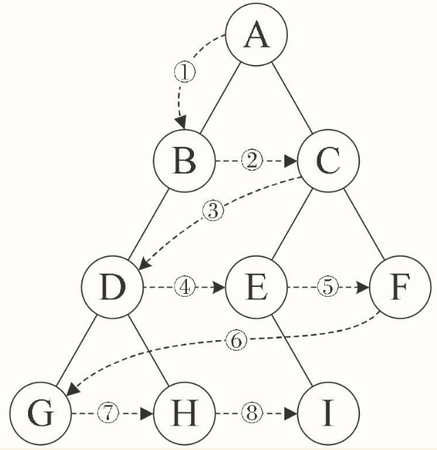

# 二叉树

## 二叉树的特点

- 每个结点最多有两棵子树，所以二叉树中不存在度大于2的结点。注意不是只有两棵子树，而是最多有。没有子树或者有一棵子树都是可以的。

- 左子树和右子树是有顺序的，次序不能任意颠倒。就像人有双手、双脚，但显然左手、左脚和右手、右脚是不一样的，右手戴左手套、右脚穿左鞋都会极其别扭和难受。

- 即使树中某结点只有一棵子树，也要区分它是左子树还是右子树

### 五种基本形态

- 1.空二叉树。
- 2.只有一个根结点。
- 3.根结点只有左子树。
- 4.根结点只有右子树。
- 5.根结点既有左子树又有右子树。

### 特殊的二叉树

#### 斜树

所有的结点都只有左子树的二叉树叫左斜树。所有结点都是只有右子树的二叉树叫右斜树。

斜树有很明显的特点，就是每一层都只有一个结点，结点的个数与二叉树的深度相同。

其实线性表结构就可以理解为是树的一种极其特殊的表现形式。

#### 满二叉树（Fully Binary Tree）

 

叶子节点全部在最底层，出现在其他层就不可能达成平衡。且除叶子节点外，每个节点都有左右两个子节点

特点有：

- （1）叶子只能出现在最下一层。出现在其他层就不可能达成平衡。
- （2）非叶子结点的度一定是2。否则就是“缺胳膊少腿”了。
- （3）在同样深度的二叉树中，满二叉树的结点个数最多，叶子数最多。

#### 完全二叉树（Complete Binary Tree）

对一棵具有n个结点的二叉树按层序编号，如果编号为i（1≤i≤n）的结点与同样深度的满二叉树中编号为i的结点在二叉树中位置完全相同，则这棵二叉树称为完全二叉树


特点：

- （1）叶子结点只能出现在最下两层。
- （2）最下层的叶子一定集中在左部连续位置。
- （3）倒数二层，若有叶子结点，一定都在右部连续位置。
- （4）如果结点度为1，则该结点只有左孩子，即不存在只有右子树的情况。
- （5）同样结点数的二叉树，完全二叉树的深度最小。

## 二叉树的性质

//TODO:

## 二叉树的存储结构

### 顺序存储结构

它定义的严格，所以用顺序结构也可以表现出二叉树的结构来


对存储空间的浪费，所以，顺序存储结构一般只用于完全二叉树

### 二叉链表

顺序存储适用性不强，我们就要考虑链式存储结构。二叉树每个结点最多有两个孩子，所以为它设计一个数据域和两个指针域是比较自然的想法，我们称这样的链表叫做二叉链表。结点结构：

```
lchild | data | rchild
```

其中data是数据域，lchild和rchild都是指针域，分别存放指向左孩子和右孩子的指针

结点结构定义:

```c
/* 二叉树的二叉链表结点结构定义 */
/* 结点结构 */
typedef struct BiTNode                  
{
    /* 结点数据 */
    TElemType data;                     
    /* 左右孩子指针 */
    struct BiTNode *lchild, *rchild;    
} BiTNode, *BiTree;
```


就如同树的存储结构中讨论的一样，如果有需要，还可以再增加一个指向其双亲的指针域，那样就称之为三叉链表。

## 二叉树的遍历

二叉树的遍历（traversing binary tree）是指从根结点出发，按照某种次序依次访问二叉树中所有结点，使得每个结点被访问一次且仅被访问一次。

**这里有两个关键词：访问和次序。**

访问其实是要根据实际的需要来确定具体做什么，比如对每个结点进行相关计算，输出打印等，它算作是一个抽象操作。在这里我们可以简单地假定访问就是输出结点的数据信息。

二叉树的遍历次序不同于线性结构，最多也就是从头至尾、循环、双向等简单的遍历方式。树的结点之间不存在唯一的前驱和后继关系，在访问一个结点后，下一个被访问的结点面临着不同的选择。就像你人生的道路上，高考填志愿要面临哪个城市、哪所大学、具体专业等选择，由于选择方式的不同，遍历的次序就完全不同了。

**二叉树的遍历方式可以很多，如果我们限制了从左到右的习惯方式，那么主要就分为四种**

### 前序遍历/先序遍历

规则是若二叉树为空，则空操作返回，否则先访问根结点，然后前序遍历左子树，再前序遍历右子树。如图遍历的顺序为：ABDGH-CEIF。


对于树中的任意节点来说，先打印这个节点，然后再打印它的左子树，最后打印它的右子树。

```javascript
function preOrder(node){
    if(!node) return;
    console.log(node.data);
    preOrder(node.left);
    preOrder(node.right);
}
```

```c
/* 二叉树的前序遍历递归算法 */
void PreOrderTraverse(BiTree T)
{
    if (T == NULL)
        return;
    /* 显示结点数据，可以更改为其他对结点操作 */
    printf("%c", T->data);
    /* 再先序遍历左子树 */
    PreOrderTraverse(T->lchild);
    /* 最后先序遍历右子树 */
    PreOrderTraverse(T->rchild);
}
```

### 中序遍历

规则是若树为空，则空操作返回，否则从根结点开始（注意并不是先访问根结点），中序遍历根结点的左子树，然后是访问根结点，最后中序遍历右子树。如图遍历的顺序为：GDHBAE-ICF。


对于树中的任意节点来说，先打印它的左子树，然后再打印它本身，最后打印它的右子树

```javascript
function inOrder(node){
    if(!node) return;
    preOrder(node.left);
    console.log(node.data);
    preOrder(node.right);
}
```

```c
/* 二叉树的中序遍历递归算法 */
void InOrderTraverse(BiTree T)
{
    if (T == NULL)
        return;
    /* 中序遍历左子树 */
    InOrderTraverse(T->lchild);    
    /* 显示结点数据，可以更改为其他对结点操作 */
    printf("%c", T->data);         
    /* 最后中序遍历右子树 */
    InOrderTraverse(T->rchild);    
}
```

### 后序遍历

规则是若树为空，则空操作返回，否则从左到右先叶子后结点的方式遍历访问左右子树，最后是访问根结点。如图遍历的顺序为：GHDBIEFCA


对于树中的任意节点来说，先打印它的左子树，然后打印它的右子树，最后打印它本身

```javascript
function postOrder(node){
    if(!node) return;
    postOrder(node.left);
    postOrder(node.right);
    console.log(node.data);
}
```

```c
/* 二叉树的后序遍历递归算法 */
void PostOrderTraverse(BiTree T)
{
    if (T == NULL)
        return;
    /* 先后序遍历左子树 */
    PostOrderTraverse(T->lchild);    
    /* 再后序遍历右子树 */
    PostOrderTraverse(T->rchild);    
    /* 显示结点数据，可以更改为其他对结点操作 */
    printf("%c", T->data);           
}
```

### 层序遍历

规则是若树为空，则空操作返回，否则从树的第一层，也就是根结点开始访问，从上而下逐层遍历，在同一层中，按从左到右的顺序对结点逐个访问。如图遍历的顺序为：ABCDEFGHI。



### ？？遍历方法的用途？？

研究这么多遍历的方法干什么呢？

我们用图形的方式来表现树的结构，应该说是非常直观和容易理解，但是对于计算机来说，它只有循环、判断等方式来处理，也就是说，它只会处理线性序列，而我们刚才提到的四种遍历方法，其实都是在把树中的结点变成某种意义的线性序列，这就给程序的实现带来了好处。

## 二叉树的建立

为了能让每个结点确认是否有左右孩子，我们对它进行了扩展，也就是将二叉树中每个结点的空指针引出一个虚结点，其值为一特定值，比如“#”。我们称这种处理后的二叉树为原二叉树的扩展二叉树。扩展二叉树就可以做到一个遍历序列确定一棵二叉树了。比如图前序遍历序列就为AB#D##C##。


## 线索二叉树

增设两个标志域ltag和rtag，注意ltag和rtag只是存放0或1数字的布尔型变量，其占用的内存空间要小于像lchild和rchild的指针变量。结点结构:

```
lchild | ltag | data | rtag | rchild
```
ltag为0时指向该结点的左孩子，为1时指向该结点的前驱。

rtag为0时指向该结点的右孩子，为1时指向该结点的后继。


### 线索二叉树结构实现

```c
/* 二叉树的二叉线索存储结构定义 */
/* Link==0表示指向左右孩子指针 */
/* Thread==1表示指向前驱或后继的线索 */
typedef enum {Link, Thread} PointerTag;    
/* 二叉线索存储结点结构 */
typedef struct BiThrNode                   
{
    /* 结点数据 */
    TElemType data;                        
    /* 左右孩子指针 */
    struct BiThrNode *lchild, *rchild;     
    PointerTag LTag;
    /* 左右标志 */
    PointerTag RTag;                       
} BiThrNode, *BiThrTree;
```

线索化的实质就是将二叉链表中的空指针改为指向前驱或后继的线索。由于前驱和后继的信息只有在遍历该二叉树时才能得到，所以线索化的过程就是在遍历的过程中修改空指针的过程。

中序：


## 树、森林与二叉树的转换

### 树转换为二叉树

树转换为二叉树的步骤如下

- 1.加线。在所有兄弟结点之间加一条连线。
- 2.去线。对树中每个结点，只保留它与第一个孩子结点的连线，删除它与其他孩子结点之间的连线。
- 3.层次调整。以树的根结点为轴心，将整棵树顺时针旋转一定的角度，使之结构层次分明。注意第一个孩子是二叉树结点的左孩子，兄弟转换过来的孩子是结点的右孩子。


### 森林转换为二叉树

步骤如下

- 1.把每个树转换为二叉树。
- 2.第一棵二叉树不动，从第二棵二叉树开始，依次把后一棵二叉树的根结点作为前一棵二叉树的根结点的右孩子，用线连接起来。当所有的二叉树连接起来后就得到了由森林转换来的二叉树。


### 二叉树转换为树

步骤如下：

- 1.加线。若某结点的左孩子结点存在，则将这个左孩子的右孩子结点、右孩子的右孩子结点、右孩子的右孩子的右孩子结点……哈，反正就是左孩子的n个右孩子结点都作为此结点的孩子。将该结点与这些右孩子结点用线连接起来。
- 2.去线。删除原二叉树中所有结点与其右孩子结点的连线。
- 3.层次调整。使之结构层次分明。


### 二叉树转换为森林

判断一棵二叉树能够转换成一棵树还是森林，标准很简单，那就是只要看这棵二叉树的根结点有没有右孩子，有就是森林，没有就是一棵树。那么如果是转换成森林，步骤如下：

- 1.从根结点开始，若右孩子存在，则把与右孩子结点的连线删除，再查看分离后的二叉树，若右孩子存在，则连线删除……，直到所有右孩子连线都删除为止，得到分离的二叉树。
- 2.再将每棵分离后的二叉树转换为树即可。


# 树与森林的遍历

树的遍历分为两种方式：

- 1.一种是先根遍历树，即先访问树的根结点，然后依次先根遍历根的每棵子树
- 2.另一种是后根遍历，即先依次后根遍历每棵子树，然后再访问根结点。比如图67中右下方的树，它的先根遍历序列为ABEFCDG，后根遍历序列为EFBCGDA。

森林的遍历也分为两种方式：

- 1.前序遍历：先访问森林中第一棵树的根结点，然后再依次先根遍历根的每棵子树，再依次用同样方式遍历除去第一棵树的剩余树构成的森林。比如图68下面三棵树的森林，前序遍历序列的结果就是ABCDEFGHJI。
- 2.后序遍历：是先访问森林中第一棵树，后根遍历的方式遍历每棵子树，然后再访问根结点，再依次同样方式遍历除去第一棵树的剩余树构成的森林。比如图68下面三棵树的森林，后序遍历序列的结果就是BCDAFEJHIG。

# 赫夫曼树及其应用

美国数学家赫夫曼（David Huffman），也有的翻译为哈夫曼。他在1952年发明了赫夫曼编码，为了纪念他的成就，于是就把他在编码中用到的特殊的二叉树称之为赫夫曼树，他的编码方法称为赫夫曼编码。也就是说，我们现在介绍的知识全都来自于近60年前这位伟大科学家的研究成果，而我们平时所用的压缩和解压缩技术也都是基于赫夫曼的研究之上发展而来

## 赫夫曼树定义与原理

路径长度

带权结点

结点的带权的路径长度为从该结点到树根之间的路径长度与结点上权的乘积。

树的带权路径长度为树中所有叶子结点的带权路径长度之和。

假设有n个权值{w1,w2,...,wn}，构造一棵有n个叶子结点的二叉树，每个叶子结点带权wk，每个叶子的路径长度为lk，我们通常记作，则其中带权路径长度WPL最小的二叉树称做赫夫曼树。

赫夫曼树的赫夫曼算法描述：

- 1.根据给定的n个权值{w1,w2,...,wn}构成n棵二叉树的集合F={T1,T2,...,Tn}，其中每棵二叉树Ti中只有一个带权为wi根结点，其左右子树均为空。
- 2.在F中选取两棵根结点的权值最小的树作为左右子树构造一棵新的二叉树，且置新的二叉树的根结点的权值为其左右子树上根结点的权值之和。
- 3.在F中删除这两棵树，同时将新得到的二叉树加入F中。
- 4.重复2和3步骤，直到F只含一棵树为止。这棵树便是赫夫曼树。

## 赫夫曼编码

一般地，设需要编码的字符集为{d1,d2,...,dn}，各个字符在电文中出现的次数或频率集合为{w1,w2,...,wn}，以d1,d2,...,dn作为叶子结点，以w1,w2,...,wn作为相应叶子结点的权值来构造一棵赫夫曼树。规定赫夫曼树的左分支代表0，右分支代表1，则从根结点到叶子结点所经过的路径分支组成的0和1的序列便为该结点对应字符的编码，这就是赫夫曼编码。

//TODO:

# 总结回顾

终于到了总结的时间，这一章与前面章节相比，显得过于庞大了些，原因也就在于树的复杂性和变化丰富度是前面的线性表所不可比拟的。即使在本章之后，我们还要讲解关于树这一数据结构的相关知识，可见它的重要性。

开头我们提到了树的定义，讲到了递归在树定义中的应用。提到了如子树、结点、度、叶子、分支结点、双亲、孩子、层次、深度、森林等诸多概念，这些都是需要在理解的基础上去记忆的。

我们谈到了树的存储结构时，讲了双亲表示法、孩子表示法、孩子兄弟表示法等不同的存储结构。

并由孩子兄弟表示法引出了我们这章中最重要一种树，二叉树。

二叉树每个结点最多两棵子树，有左右之分。提到了斜树，满二叉树、完全二叉树等特殊二叉树的概念。

我们接着谈到它的各种性质，这些性质给我们研究二叉树带来了方便。

二叉树的存储结构由于其特殊性使得既可以用顺序存储结构又可以用链式存储结构表示。

遍历是二叉树最重要的一门学问，前序、中序、后序以及层序遍历都是需要熟练掌握的知识。要让自己要学会用计算机的运行思维去模拟递归的实现，可以加深我们对递归的理解。不过，并非二叉树遍历就一定要用到递归，只不过递归的实现比较优雅而已。这点需要明确。

二叉树的建立自然也是可以通过递归来实现。

研究中也发现，二叉链表有很多浪费的空指针可以利用，查找某个结点的前驱和后继为什么非要每次遍历才可以得到，这就引出了如何构造一棵线索二叉树的问题。线索二叉树给二叉树的结点查找和遍历带来了高效率。

树、森林看似复杂，其实它们都可以转化为简单的二叉树来处理，我们提供了树、森林与二叉树的互相转换的办法，这样就使得面对树和森林的数据结构时，编码实现成为了可能。

最后，我们提到了关于二叉树的一个应用，赫夫曼树和赫夫曼编码，对于带权路径的二叉树做了详尽地讲述，让你初步理解数据压缩的原理，并明白其是如何做到无损编码和无错解码的。