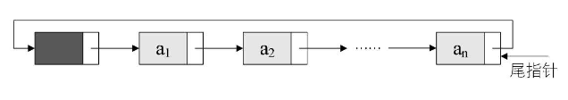

# 线性表：

线性表就是数据排成像一条线一样的结构，**零个或多个数据元素的有限序列，它是一个序列，也就是说，元素之间是有顺序的**。
每个线性表上的数据最多只有前和后两个方向。
```
a1--a2...(ai-1)--(ai)--(ai+1)...an
```
若将线性表记为（a1，…，ai-1，ai，ai+1，…，an），则表中ai-1领先于ai，ai+1领先于ai，称ai-1是ai的**直接前驱元素**，ai+1是ai的**直接后继元素**。当i=1，2，…，n-1时，ai有且仅有一个直接后继，当i=2，3，…，n时，ai有且仅有一个直接前驱。

所以线性表元素的个数n（n≥0）定义为线性表的长度，当n=0时，称为空表。

在非空表中的每个数据元素都有一个确定的位置，如a1是第一个数据元素，an是最后一个数据元素，ai是第i个数据元素，称i为数据元素ai在线性表中的**位序**。

具有线性表结构的数据结构有：数组、链表、队列、栈等。

 

## 线性表的抽象数据类型定义

 

```txt
ADT 线性表(List)
Data
    线性表的数据对象集合为{a1, a2, ......, an}，每个元素的类型均为DataType。
    其中，除第一个元素a1外，每一个元素有且只有一个直接前驱元素，
    除了最后一个元素an外，每一个元素有且只有一个直接后继元素。
    数据元素之间的关系是一对一的关系。
Operation
    InitList(*L):          初始化操作，建立一个空的线性表L。
    ListEmpty(L):          若线性表为空，返回true，否则返回false。
    ClearList(*L):         将线性表清空。
    GetElem(L, i, *e):     将线性表L中的第i个位置元素值返回给e。
    LocateElem(L, e):      在线性表L中查找与给定值e相等的元素，
                           如果查找成功，返回该元素在表中序号表示成功；
```

与之相对立的概念是非线性表，比如二叉树、堆、图等。非线性表中的数据之间并不是简单的前后关系。


## 线性表的顺序存储结构

类比 排队

### 顺序存储定义

线性表的顺序存储结构，指的是用一段地址连续的存储单元依次存储线性表的数据元素。线性表（a1,a2,......,an）的顺序存储示意图如下：

```
a1|a2|......|ai-1|ai|......|an
```

### 描述顺序存储结构需要三个属性：

- 存储空间的起始位置：数组data，它的存储位置就是存储空间的存储位置。
- 线性表的最大存储容量：数组长度MaxSize。
- 线性表的当前长度：length。

### 顺序存储方式

内存中找了块地儿，通过占位的形式，把一定内存空间给占了，然后把相同数据类型的数据元素依次存放在这块空地中.既然线性表的每个数据元素的类型都相同，所以可以用C语言（其他语言也相同）的一维数组来实现顺序存储结构:把第一个数据元素存到数组下标为0的位置中，这个0的位置非常关键，它是存储空间的起始位置接着把线性表相邻的元素存储在数组中相邻的位置。随着数据插入，线性表的当前长度不能超过存储容量，即数组的长度。

线性表的长度是线性表中数据元素的个数，随着线性表插入和删除操作的进行，这个量是变化的。 在任意时刻，线性表的长度应该小于等于数组的长度

## 顺序存储结构的插入与删除

### 获得元素操作

对于线性表的顺序存储结构来说，如果我们要实现GetElem操作，即将线性表L中的第i个位置元素值返回，其实是非常简单的。就程序而言，只要i的数值在数组下标范围内，就是把数组第i-1下标的值返回即可

### 插入操作

插入算法的思路：

- 如果插入位置不合理，抛出异常；
- 如果线性表长度大于等于数组长度，则抛出异常或动态增加容量；
- 从最后一个元素开始向前遍历到第i个位置，分别将它们都向后移动一个位置；
- 将要插入元素填入位置i处； ?表长加1。

### 删除操作

删除算法的思路：

- 如果删除位置不合理，抛出异常；
- 取出删除元素；
- 从删除元素位置开始遍历到最后一个元素位置，分别将它们都向前移动一个位置；
- 表长减1。

### 插入和删除的时间复杂度

先来看最好的情况，如果元素要插入到最后一个位置，或者删除最后一个元素，此时时间复杂度为O(1)，因为不需要移动元素的，就如同来了一个新人要正常排队，当然是排在最后，如果此时他又不想排了，那么他一个人离开就好了，不影响任何人。

最坏的情况呢，如果元素要插入到第一个位置或者删除第一个元素，此时时间复杂度是多少呢？那就意味着要移动所有的元素向后或者向前，所以这个时间复杂度为O(n)。

至于平均的情况，由于元素插入到第i个位置，或删除第i个元素，需要移动n-i个元素。根据概率原理，每个位置插入或删除元素的可能性是相同的，也就说位置靠前，移动元素多，位置靠后，移动元素少。最终平均移动次数和最中间的那个元素的移动次数相等，为(n-1)/2。

可以得出，平均时间复杂度还是O(n)。线性表的顺序存储结构，在存、读数据时，不管是哪个位置，时间复杂度都是O(1)；而插入或删除时，时间复杂度都是O(n)。这就说明，它比较适合元素个数不太变化，而更多是存取数据的应用。

### 线性表顺序存储结构的优缺点

#### 优点

- 无须为表示表中元素之间的逻辑关系而增加额外的存储空间
- 可以快速地存取表中任一位置的元素

#### 缺点

- 插入和删除操作需要移动大量元素
- 当线性表长度变化较大的时候，难以确定存储空间的容量
- 造成存储空间的‘碎片’

## 线性表的链式存储结构

### 顺序存储结构不足的解决办法

线性表的顺序存储结构。它是有缺点的，最大的缺点就是插入和删除时需要移动大量元素，这显然就需要耗费时间。当插入和删除时，就要移动大量元素，仔细分析后，发现原因就在于相邻两元素的存储位置也具有邻居关系。它们编号是1，2，3，…，n，它们在内存中的位置也是挨着的，中间没有空隙，当然就无法快速介入，而删除后，当中就会留出空隙，自然需要弥补。

### 线性表链式存储结构定义

线性表的链式存储结构的特点是用一组任意的存储单元存储线性表的数据元素，这组存储单元可以是连续的，也可以是不连续的。这就意味着，这些数据元素可以存在内存未被占用的任意位置


以前在顺序结构中，每个数据元素只需要存数据元素信息就可以了。现在链式结构中，除了要存数据元素信息外，还要存储它的后继元素的存储地址。

为了表示每个数据元素ai与其直接后继数据元素ai+1之间的逻辑关系，对数据元素ai来说，除了存储其本身的信息之外，还需存储一个指示其直接后继的信息（即直接后继的存储位置）。

我们把存储数据元素信息的域称为数据域，把存储直接后继位置的域称为指针域。指针域中存储的信息称做指针或链。这两部分信息组成数据元素ai的存储映像，称为结点（Node）。

n个结点（ai的存储映像）链结成一个链表，即为线性表（a1,a2,...,an）的链式存储结构，因为此链表的每个结点中只包含一个指针域，所以叫做单链表。单链表正是通过每个结点的指针域将线性表的数据元素按其逻辑次序链接在一起


对于线性表来说，总得有个头有个尾，链表也不例外。我们把链表中第一个结点的存储位置叫做头指针，那么整个链表的存取就必须是从头指针开始进行了。之后的每一个结点，其实就是上一个的后继指针指向的位置。想象一下，最后一个结点，它的指针指向哪里？
最后一个，当然就意味着直接后继不存在了，所以我们规定，线性链表的最后一个结点指针为“空”(通常用NULL或“^”符号表示)


有时，我们为了更加方便地对链表进行操作，会在单链表的第一个结点前附设一个结点，称为头结点。头结点的数据域可以不存储任何信息，谁叫它是第一个呢，有这个特权。也可以存储如线性表的长度等附加信息，头结点的指针域存储指向第一个结点的指针


### 头指针与头结点的异同

#### 头指针

- 头指针是指链表指向第一个结点的指针，若链表有头结点，则是指向头结点的指针
- 头指针具有标识作用，所以常用头指针冠以链表的名字
- 无论链表是否为空，头指针均不为空。头指针是链表的必要元素

#### 头结点

- 头结点是为了操作的统一和方便而设立的，放在第一元素的结点之前，其数据域一般无意义（也可存放链表的长度）
- 有了头结点，对在第一元素结点前插入结点和删除第一结点，其操作与其它结点的操作就统一了
- 头结点不一定是链表必须要素

## 单链表的读取

在线性表的顺序存储结构中，我们要计算任意一个元素的存储位置是很容易的。但在单链表中，由于第i个元素到底在哪？没办法一开始就知道，必须得从头开始找。因此，对于单链表实现获取第i个元素的数据的操作GetElem，在算法上，相对要麻烦一些

获得链表第i个数据的算法思路：

- 1.声明一个指针p指向链表第一个结点，初始化j从1开始；
- 2.当`j<i`时，就遍历链表，让p的指针向后移动，不断指向下一结点，j累加1；
- 3.若到链表末尾p为空，则说明第i个结点不存在；
- 4.否则查找成功，返回结点p的数据。

```c
/* 初始条件：顺序线性表L已存在，1≤i≤
   ListLength(L) */
/* 操作结果：用e返回L中第i个数据元素的值 */
Status GetElem(LinkList L, int i, ElemType *e)
{
    int j;
    LinkList p;            /* 声明一指针p */
    p = L->next;        /* 让p指向链表L的第个结点 */
    j = 1;                 /* j为计数器 */
    /* p不为空且计数器j还没有等于i时，循环继续 */
    while (p && j < i)    
    {
        p = p->next;    /* 让p指向下一个结点 */
        ++j;
    }
    if (!p || j > i)
        return ERROR;      /* 第i个结点不存在 */
    *e = p->data;       /* 取第i个结点的数据 */
    return OK;
}
```

就是从头开始找，直到第i个结点为止。由于这个算法的时间复杂度取决于i的位置，当i=1时，则不需遍历，第一个就取出数据了，而当i=n时则遍历n-1次才可以。因此最坏情况的时间复杂度是O(n).

单链表的结构中没有定义表长，所以不能事先知道要循环多少次，因此也就不方便使用for来控制循环。其主要核心思想就是“工作指针后移”，这其实也是很多算法的常用技术。

## 单链表的插入与删除

### 单链表的插入

单链表第i个数据插入结点的算法思路：

- 1.声明一指针p指向链表头结点，初始化j从1开始； 
- 2.当`j<i`时，就遍历链表，让p的指针向后移动，不断指向下一结点，j累加1； 
- 3.若到链表末尾p为空，则说明第i个结点不存在； 
- 4.否则查找成功，在系统中生成一个空结点s； 
- 5.将数据元素e赋值给s->data； 
- 6.单链表的插入标准语句s->next=p->next;p->next=s； 7.返回成功。
```c
/* 初始条件：顺序线性表L已存在，1≤i≤
   ListLength(L)， */
/* 操作结果：在L中第i个结点位置之前插入新的数
   据元素e，L的长度加1 */
Status ListInsert(LinkList *L, int i, ElemType e)
{
    int j;
    LinkList p, s;
    p = *L;
    j = 1;
    /* 寻找第i-1个结点 */
    while (p && j < i)                     
    {
        p = p->next;
        ++j;
    }
    /* 第i个结点不存在 */
    if (!p || j > i)
        return ERROR;                      
    /* 生成新结点（C标准函数） */
    s = (LinkList)malloc(sizeof(Node));    
    s->data = e;
    /* 将p的后继结点赋值给s的后继 */
    s->next = p->next;                    
    /* 将s赋值给p的后继 */
    p->next = s;                           
    return OK;
```

### 单链表的删除

单链表第i个数据删除结点的算法思路：

- 1.声明一指针p指向链表头结点，初始化j从1开始；
- 2.当`j<i`时，就遍历链表，让p的指针向后移动，不断指向下一个结点，j累加1；
- 3.若到链表末尾p为空，则说明第i个结点不存在；
- 4.否则查找成功，将欲删除的结点p->next赋值给q；
- 5.单链表的删除标准语句p->next=q->next；
- 6.将q结点中的数据赋值给e，作为返回；
- 7.释放q结点；
- 8.返回成功。
```c
/* 初始条件：顺序线性表L已存在，1≤i≤
   ListLength(L) */
/* 操作结果：删除L的第i个结点，并用e返回其
   值，L的长度减1 */
Status ListDelete(LinkList *L, int i, ElemType *e)
{
    int j;
    LinkList p, q;
    p = *L;
    j = 1;
    /* 遍历寻找第i-1个结点 */
    while (p->next && j < i)    
    {
        p = p->next;
        ++j;
    }
    /* 第i个结点不存在 */
    if (!(p->next) || j > i)
        return ERROR;           
    q = p->next;
    /* 将q的后继赋值给p的后继 */
    p->next = q->next;          
    /* 将q结点中的数据给e */
    *e = q->data;               
    /* 让系统回收此结点，释放内存 */
    free(q);                    
    return OK;
```

### 单链表和顺序存储结构对比

从整个算法来说，我们很容易推导出：它们的时间复杂度都是O(n)。如果在我们不知道第i个结点的指针位置，单链表数据结构在插入和删除操作上，与线性表的顺序存储结构是没有太大优势的。但如果，我们希望从第i个位置，插入10个结点，对于顺序存储结构意味着，每一次插入都需要移动n-i个结点，每次都是O(n)。而单链表，我们只需要在第一次时，找到第i个位置的指针，此时为O(n)，接下来只是简单地通过赋值移动指针而已，时间复杂度都是O(1)。显然，对于插入或删除数据越频繁的操作，单链表的效率优势就越是明显。

### 单链表的整表创建

顺序存储结构的创建，其实就是一个数组的初始化，即声明一个类型和大小的数组并赋值的过程。而单链表和顺序存储结构就不一样，它不像顺序存储结构这么集中，它可以很散，是一种动态结构。对于每个链表来说，它所占用空间的大小和位置是不需要预先分配划定的，可以根据系统的情况和实际的需求即时生成。
所以创建单链表的过程就是一个动态生成链表的过程。即从“空表”的初始状态起，依次建立各元素结点，并逐个插入链表。

单链表整表创建的算法思路：

- 1.声明一指针p和计数器变量i；
- 2.初始化一空链表L；
- 3.让L的头结点的指针指向NULL，即建立一个带头结点的单链表；
- 4.循环：
  - 生成一新结点赋值给p；
  - 随机生成一数字赋值给p的数据域p->data；
  - 将p插入到头结点与前一新结点之间。

**插队的办法，就是始终让新结点在第一的位置。我也可以把这种算法简称为头插法**

```c
/* 随机产生n个元素的值，建立带表头结点的单链
   线性表L（头插法）
*/
void CreateListHead(LinkList *L, int n)
{
    LinkList p;
    int i;
    /* 初始化随机数种子 */
    srand(time(0));                            
    *L = (LinkList)malloc(sizeof(Node));
    /* 先建立一个带头结点的单链表 */
    (*L)->next = NULL;                         
    for (i = 0; i < n; i++)
    {
        /* 生成新结点 */
        p = (LinkList)malloc(sizeof(Node));    
        /* 随机生成100以内的数字 */
        p->data = rand() % 100 + 1;            
        p->next = (*L)->next;
        /* 插入到表头 */
        (*L)->next = p;                        
    }
}
```

**排队时的正常思维，所谓的先来后到。我们把每次新结点都插在终端结点的后面，这种算法称之为尾插法**

```c
/* 随机产生n个元素的值，建立带表头结点的单链
线性表L（尾插法） */
void CreateListTail(LinkList *L, int n)
{
    LinkList p,r;
    int i;
    /* 初始化随机数种子 */
    srand(time(0));                         
    /* 为整个线性表 */
    *L = (LinkList)malloc(sizeof(Node));    
    /* r为指向尾部的结点 */
    r = *L;                                 
    for (i = 0; i < n; i++)
    {
        /* 生成新结点 */
        p = (Node *)malloc(sizeof(Node));   
        /* 随机生成100以内的数字 */
        p->data = rand() % 100 + 1;         
        /* 将表尾终端结点的指针指向新结点 */
        r->next = p;                        
        /* 将当前的新结点定义为表尾终端结点 */
        r = p;                              
    }
    /* 表示当前链表结束 */
    r->next = NULL;                         
}
```

## 单链表的整表删除

当我们不打算使用这个单链表时，我们需要把它销毁，其实也就是在内存中将它释放掉，以便于留出空间给其他程序或软件使用。
单链表整表删除的算法思路如下：

- 1.声明一指针p和q；
- 2.将第一个结点赋值给p；
- 3.循环：
  - 将下一结点赋值给q；
  - 释放p；
  - 将q赋值给p。

```c
/* 初始条件：顺序线性表L已存在，操作结果：将L
   重置为空表 */
Status ClearList(LinkList *L)
{
    LinkList p, q;
    /* p指向第一个结点 */
    p = (*L)->next;       
    /* 没到表尾 */
    while (p)             
    {
        q = p->next;
        free(p);
        p=q;
    }
    /* 头结点指针域为空 */
    (*L)->next = NULL;    
    return OK;
}
```

## 单链表结构与顺序存储结构优缺点


可以得出一些经验性的结论：

若线性表需要频繁查找，很少进行插入和删除操作时，宜采用顺序存储结构。若需要频繁插入和删除时，宜采用单链表结构。比如说游戏开发中，对于用户注册的个人信息，除了注册时插入数据外，绝大多数情况都是读取，所以应该考虑用顺序存储结构。而游戏中的玩家的武器或者装备列表，随着玩家的游戏过程中，可能会随时增加或删除，此时再用顺序存储就不太合适了，单链表结构就可以大展拳脚。当然，这只是简单的类比，现实中的软件开发，要考虑的问题会复杂得多。

当线性表中的元素个数变化较大或者根本不知道有多大时，最好用单链表结构，这样可以不需要考虑存储空间的大小问题。而如果事先知道线性表的大致长度，比如一年12个月，一周就是星期一至星期日共七天，这种用顺序存储结构效率会高很多。

## 静态链表

其实C语言真是好东西，它具有的指针能力，使得它可以非常容易地操作内存中的地址和数据，这比其他高级语言更加灵活方便。后来的面向对象语言，如Java、C#等，虽不使用指针，但因为启用了对象引用机制，从某种角度也间接实现了指针的某些作用。但对于一些语言，如Basic、Fortran等早期的编程高级语言，由于没有指针，链表结构按照前面我们的讲法，它就没法实现了。怎么办呢？
有人就想出来用数组来代替指针，来描述单链表。真是不得不佩服他们的智慧，我们来看看他是怎么做到的。
首先我们让数组的元素都是由两个数据域组成，data和cur。也就是说，数组的每个下标都对应一个data和一个cur。数据域data，用来存放数据元素，也就是通常我们要处理的数据；而cur相当于单链表中的next指针，存放该元素的后继在数组中的下标，我们把cur叫做游标。
我们把这种用数组描述的链表叫做静态链表，这种描述方法还有起名叫做游标实现法。


静态链表其实是为了给没有指针的高级语言设计的一种实现单链表能力的方法。尽管大家不一定会用得上，但这样的思考方式是非常巧妙的，应该理解其思想，以备不时之需。

## 循环链表

将单链表中终端结点的指针端由空指针改为指向头结点，就使整个单链表形成一个环，这种头尾相接的单链表称为单循环链表，简称循环链表（circular linked list）

为了使空链表与非空链表处理一致，我们通常设一个头结点，当然，这并不是说，循环链表一定要头结点，这需要注意。

循环链表和单链表的主要差异就在于循环的判断条件上，原来是判断p->next是否为空，现在则是p->next不等于头结点，则循环未结束。


在单链表中，我们有了头结点时，我们可以用O(1)的时间访问第一个结点，但对于要访问到最后一个结点，却需要O(n)时间，因为我们需要将单链表全部扫描一遍。
有没有可能用O(1)的时间由链表指针访问到最后一个结点呢？当然可以。
不过我们需要改造一下这个循环链表，不用头指针，而是用指向终端结点的尾指针来表示循环链表，此时查找开始结点和终端结点都很方便了



可以看到，终端结点用尾指针rear指示，则查找终端结点是O(1)，而开始结点，其实就是rear->next->next，其时间复杂也为O(1)

要将两个循环链表合并成一个表时，有了尾指针就非常简单了。比如下面的这两个循环链表，它们的尾指针分别是rearA和rearB，如图


要想把它们合并，只需要如下的操作即可


```c
/* 保存A表的头结点，即① */
p = rearA->next;                    
/*将本是指向B表的第一个结点（不是头结点） */
rearA->next = rearB->next->next;    
/* 赋值给reaA->next，即② */
q = rearB->next;
/* 将原A表的头结点赋值给rearB->next，即③ */
rearB->next = p;                    
/* 释放q */
free(q);
```

双向链表（double linkedlist）是在单链表的每个结点中，再设置一个指向其前驱结点的指针域。所以在双向链表中的结点都有两个指针域，一个指向直接后继，另一个指向直接前驱。

```c
/* 线性表的双向链表存储结构 */
typedef struct DulNode
{
    ElemType data;
    struct DuLNode *prior;    /* 直接前驱指针 */
    struct DuLNode *next;     /* 直接后继指针 */
} DulNode, *DuLinkList;
```

既然单链表也可以有循环链表，那么双向链表当然也可以是循环表。

非空的循环的带头结点的双向链表如图


```c
p->next->prior = p = p->prior->next
```
插入操作：


```c
/* 把p赋值给s的前驱，如图中① */
s->prior = p;          
/* 把p->next赋值给s的后继，如图中② */
s->next = p->next;     
/* 把s赋值给p->next的前驱，如图中③ */
p->next->prior = s;    
/* 把s赋值给p的后继，如图中④ */
p->next = s;    
```

删除操作：


```c
/* 把p->next赋值给p->prior的后继，如图中① */
p->prior->next = p->next;     
/* 把p->prior赋值给p->next的前驱，如图中② */
p->next->prior = p->prior;    
/* 释放结点 */
free(p);     
```

双向链表相对于单链表来说，要更复杂一些，毕竟它多了prior指针，对于插入和删除时，需要格外小心。另外它由于每个结点都需要记录两份指针，所以在空间上是要占用略多一些的。不过，由于它良好的对称性，使得对某个结点的前后结点的操作，带来了方便，可以有效提高算法的时间性能。说白了，就是用空间来换时间。

## 线性表总结

线性表是零个或多个具有相同类型的数据元素的有限序列。然后谈了线性表的抽象数据类型，如它的一些基本操作。
之后我们就线性表的两大结构做了讲述，先讲的是比较容易的顺序存储结构，指的是用一段地址连续的存储单元依次存储线性表的数据元素。通常我们都是用数组来实现这一结构。
后来是我们的重点，由顺序存储结构的插入和删除操作不方便，引出了链式存储结构。它具有不受固定的存储空间限制，可以比较快捷的插入和删除操作的特点。然后我们分别就链式存储结构的不同形式，如单链表、循环链表和双向链表做了讲解，另外我们还讲了若不使用指针如何处理链表结构的静态链表方法。
总的来说，线性表的这两种结构其实是后面其他数据结构的基础，把它们学明白了，对后面的学习有着至关重要的作用。