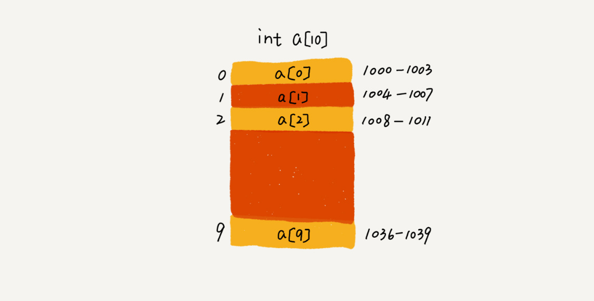
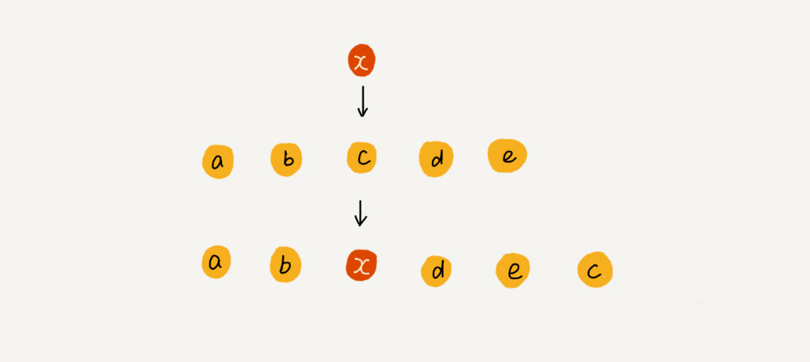

# 1.什么是数组

数组（Array）是一种 **线性表** 数据结构，它用一组 **连续的内存空间**，来存储一组具有**相同类型的数据**。(抛开语言)

## 2.连续的内存空间和相同类型的数据

因为有连续的内存空间和相同类型的数据这两个限制，数组才有 **随机访问** 的特性。同时，也因为这两个条件限制，让数组的很多操作变得非常低效，比如在数组中进行删除、插入一个数据，为了保证连续性，就需要做大量的数据搬移工作。

## 数组如何实现随机访问

 

举个例子说明

当创建一个长度为10 的数组arr时，计算机给数组arr分配一块连续内存空间1000~1039。同时，计算机也会给每个内存单元分配一个地址，计算机通过地址来访问内存中的数组。其中，内存块的首地址为base_address =  1000.
  
当计算机需要随机访问数组中的某个元素时，首先通过下面的寻址公式，计算出该元素的内存地址：

a[i]_address = base_address + i*data_type_size

其中data_type_size表示数组中每个元素的大小。

### 低效的“插入”和“删除”

把数组想象成一条正在排队的队伍，插入数据相当于有人插队，删除数据相当于有人离开队伍。

**插入操作：**

当一个人想插入队伍中第k个位置时，需要腾出第k个位置出来。所以从第k个位置开始到最后一个人都按顺序往后挪一位。

最好时间复杂度的情况：

当插队的人是排在队伍的最后一个，队伍的人都不需要移动。此时，时间复杂度为O(1)

最坏时间复杂度的情况：

当插队的人是排在队伍的第一个，队伍中的所有人都要往后移动一位。此时，时间复杂度为O(n)

因为在队伍每个位置插入的概率是一样的，所以平均情况时间复杂度为(1+2+...+n)/n = O(n)

降低插入操作 的时间复杂度技巧：

  

为避免插入数据时出现大规模的数据搬移，我们可以直接将第k位的数据搬移到数组元素的最后，把新的元素直接放入第k个位置。这样，插入一个元素的时间复杂度就降为O(1).

但这样做的前提是，对数组中的数据的顺序没有要求，即无序的。

**删除操作：**

跟插入操作类似，如果删除数组末尾的数据，则最好情况时间复杂度为O(1)；如果删除开头的数据，则最坏情况时间复杂度为O(n)；平均情况时间复杂度也为O(n)

降低删除删除操作的时间复杂度技巧：

假如我们要删除n个元素，如果是依次删除这n个元素，那数组中的数据就会被搬移n次。

优化：每次删除操作时，我们可以先记录已经删除的数据，但并不是真正地搬移数据，只是记录数据已经被删除。当数组没有更多空间存储数据时，我们再触发一次真正的删除操作，这样就大大减少删除操作导致的数据搬移。

### 容器能否完全代替数据

针对数组类型，很多语音都提供了容器类，比如JavaScript中的Array()、Java中的ArrayList、C++STL中的vector。

数组本身在定义的时候需要预先指定大小，因为需要分配连续的内存空间。当分配的内存空间不够用时，就需要重新分配更大的空间，将原来的数据复制过去。

而容器是将数组的一些操作的细节封装起来，而且支持动态扩容。这样，你就不需要关系底层的扩容逻辑，容器会自动分配更大的内存空间。因此，容器的性能会比直接使用数组，会有一定的性能消耗。

## 总结：

对于业务开发，直接使用容器，省时省力。虽然有一定损耗，但不会影响系统整体性能。

如果是做一些非常底层的开发，比如开发网络框架，性能的优化需要做到极致，这时首选数组

## 思考

Q1：前面我基于数组的原理引出JVM的标记清除垃圾回收算法核心理念。如果你使用java语言，请说下你对JVM的标记清除垃圾回收算法的理解

Q2：请思考二维数组的内存寻找公式是怎么样的？

JVM标记清除算法：

大多数主流虚拟机采用可达性分析算法来判断对象是否存活，在标记阶段，会遍历所有 GC ROOTS，将所有 GC ROOTS 可达的对象标记为存活。只有当标记工作完成后，清理工作才会开始。

不足：1.效率问题。标记和清理效率都不高，但是当知道只有少量垃圾产生时会很高效。2.空间问题。会产生不连续的内存空间碎片。

二维数组内存寻址：

对于 m * n 的数组，a [ i ][ j ] (i < m,j < n)的地址为：

address = base_address + ( i n + j) type_size

另外，对于数组访问越界造成无限循环，我理解是编译器的问题，对于不同的编译器，在内存分配时，会按照内存地址递增或递减的方式进行分配。老师的程序，如果是内存地址递减的方式，就会造成无限循环